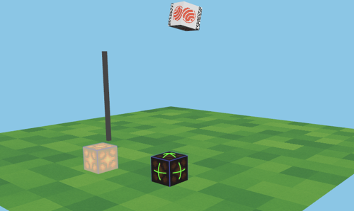

# IoTCraft

IoTCraft is a multi-component Rust project showcasing MQTT-controlled IoT devices and a desktop 3D visualizer with dynamic device positioning and persistent device management.



## Components

- **desktop-client**  
  A Rust **std** application built with Bevy. It renders a 3D scene containing:
  - **Luanti-like voxel world** with individual 1x1x1 blocks
  - **Block manipulation system** - place, remove, and manage different block types (grass, dirt, stone)
  - **World persistence** - save and load entire voxel worlds to/from JSON files
  - **Script system** - automate building with command scripts
  - **Interactive minimap** - Real-time world overview with player tracking
  - **Multiplayer infrastructure** - 3D voxel-style player avatars with animations
  - Dynamic device spawning based on MQTT announcements
  - Interactive device control via mouse clicks (lamps: ON/OFF, doors: open/close via MQTT)
  - Drag-and-drop device positioning with persistent storage
  - **Door system** - 3D doors that rotate 90 degrees when opened/closed
  - **Comprehensive console interface** - Enhanced with device listing and management commands
  - **Real-time diagnostics overlay** - Press F3 for detailed debug information
  - A rotating logo cube and thermometer indicator
  - **Enhanced WASD + mouse camera controls** - Physics-based walking mode as default
  - **Enhanced inventory system** - 9-slot hotbar with item management
  - **WASM Support** - Full WebAssembly build for browser-based gameplay with identical features
  - **MCP Integration** - Model Context Protocol server for AI assistant control
  - Comprehensive MQTT logging and diagnostics

- **mcplay**  
  A Rust **std** orchestration tool for multi-client scenario testing.  
  - **Cross-Platform Testing** - Desktop + WASM browser client coordination
  - **Visual Process Management** - Real-time TUI with status monitoring
  - **Automated Infrastructure** - MQTT server, web server, and browser management
  - **Scenario-Based Testing** - RON format scenarios with comprehensive test workflows
  - **Health Monitoring** - Readiness and liveness probes for all services
  - **System Integration** - Shell command execution, browser launching, rich messaging
  - **Keep-Alive Mode** - Extended manual testing sessions with `--keep-alive` flag

- **mqtt-server**
  A Rust **std** executable using `rumqttd` as an embedded MQTT broker.  
  Reads `rumqttd.toml` for configuration and handles MQTT v4/v5 and WebSocket connections.

- **mqtt-client**  
  A Rust **std** command-line tool using `rumqttc` for synchronous publish/subscribe.  
  Examples:
  ```bash
  # Subscribe to lamp topic
  mosquitto_sub -h localhost -p 1883 -t home/cube/light -i mqtt-client
  
  # Publish ON/OFF
  mosquitto_pub -h localhost -p 1883 -t home/cube/light -m "ON" -i mqtt-client
  ```

- **esp32-c6-client**  
  An embedded **no_std** application for the ESP32-C6 using Embassy and ESP HAL.  
  - Connects to Wi-Fi, announces itself via MQTT (`devices/announce` topic) with a unique device ID using random suffix
  - Subscribes to device-specific lamp control topic (`home/{device_id}/light`) and toggles an LED
  - Listens for position updates on `home/{device_id}/position/set` and stores coordinates persistently
  - Reads the on-board temperature sensor via I2C and publishes readings (`home/sensor/temperature`)
  - Uses NVS (Non-Volatile Storage) to persist device properties between reboots

- **esp32-c3-devkit-rust-1**  
  An embedded **no_std** application for the ESP32-C3-DevKit-RS board using Embassy.  
  Similar to the C6 client but adapted to the C3’s GPIO layout and peripherals.

## Getting Started

### Desktop Client

```bash
# Ensure MQTT broker is running:
cd mqtt-server
cargo run

# Run the Bevy 3D visualizer:
cd desktop-client
cargo run

# Run with a specific language (optional):
# Supported languages: en-US, de-DE, cs-CZ, bg-BG, es-ES, fr-FR, hr-HR, hu-HU, it-IT, ja-JP, pl-PL, pt-BR, ro-RO, sk-SK, sl-SI, zh-CN
cargo run -- --lang=de-DE  # German
cargo run -- --lang=cs-CZ  # Czech
```

**For detailed testing, multi-client setup, and web development:** See [desktop-client/README.md](desktop-client/README.md)

### Cross-Platform Testing with mcplay

**Multi-Client Orchestration:**
```bash
# Interactive scenario selector
cd mcplay
cargo run

# Run cross-platform Alice (desktop) + Bob (WASM) testing
cargo run scenarios/alice_desktop_bob_wasm_visual.ron

# Extended manual testing with keep-alive
cargo run scenarios/alice_desktop_bob_wasm_visual.ron --keep-alive

# List all available scenarios
cargo run -- --list-scenarios

# Validate scenario without running
cargo run scenarios/alice_desktop_bob_wasm_visual.ron --validate
```

**Key Features:**
- **Automated Setup** - Builds WASM client, starts web server, opens browser
- **Visual Management** - See both Alice (desktop) and Bob (WASM) in process list
- **Cross-Platform Sync** - Test desktop ↔ browser multiplayer synchronization
- **Rich Scenarios** - Medieval world creation with comprehensive testing guides

**For comprehensive orchestration and testing:** See [mcplay/README.md](mcplay/README.md)

### MQTT Server

```bash
cd mqtt-server
cargo run
```

### MQTT Client

```bash
cd mqtt-client
cargo run
```

### ESP32 Clients

Set Wi-Fi SSID/PASSWORD and broker address in the embedded source, then flash:

```bash
export SSID="your_wifi_ssid"
export PASSWORD="your_wifi_password"
export SERVER_IP="your_mqtt_broker_ip"
# ESP32-C6
cd esp32-c6-client
cargo run --release

# ESP32-C3-DevKit
cd esp32-c3-devkit-rust-1
cargo run --release
```

#### Simulation

Use Wokwi simulator ([wokwi-cli](https://docs.wokwi.com/wokwi-ci/cli-usage), 
[JetBrains plugin](https://plugins.jetbrains.com/plugin/23826-wokwi-simulator) or 
[VS Code plugin](https://docs.wokwi.com/vscode/getting-started)) to simulate ESP32-C3 device.

```bash
export SSID="Wokwi-GUEST"
export PASSWORD=""
export SERVER_IP="your_mqtt_broker_ip"

cd esp32-c3-devkit-rust-1
cargo build --release
wokwi-cli
```

### WASM Browser Support

**Build and Serve Web Client:**
```bash
cd desktop-client

# Build optimized WASM version
cargo ctask web-build --release

# Serve web client locally
cargo ctask web-serve --port 8000

# Combined build and serve for development
cargo ctask web-dev

# Open browser (after web server is running)
open http://localhost:8000
```

**Cross-Platform Features:**
- **Identical Functionality** - Same features as desktop (world building, MQTT, multiplayer)
- **WebSocket MQTT** - Automatic WebSocket bridge for browser MQTT communication
- **Shared Worlds** - Desktop and WASM clients can join the same multiplayer worlds
- **Real-Time Sync** - Block placement, device control, and world state synchronization
- **Browser Controls** - Full keyboard/mouse support with pointer lock for camera

**For detailed WASM development:** See [desktop-client/README_WEB.md](desktop-client/README_WEB.md)

## Device Registration System

The IoTCraft system now supports dynamic device registration:

1. **ESP32 devices** automatically announce themselves when they connect to Wi-Fi
2. **Desktop client** listens for device announcements and automatically spawns 3D representations
3. **Interactive control** allows clicking on devices in the 3D world to control them
4. **Dynamic topics** use device-specific MQTT topics (`home/{device_id}/light`)

### Device Announcement Format

Devices announce themselves using this JSON format on the `devices/announce` topic:
```json
{
  "device_id": "esp32c6_aabbcc112233",
  "device_type": "lamp", 
  "state": "online",
  "location": { "x": 1.0, "y": 0.5, "z": 2.0 }
}
```

**Supported Device Types:**
- `lamp` - Cubic devices that can be toggled ON/OFF (change color and emit light)
- `door` - Tall, thin rectangular devices (0.2 x 2.0 x 1.0) that rotate 90° when opened/closed

### MQTT Topics

- `devices/announce` - Device registration announcements
- `home/{device_id}/light` - Individual device lamp control  
- `home/{device_id}/position/set` - Device position updates (JSON with x, y, z coordinates)
- `home/sensor/temperature` - Temperature sensor readings

### Testing with Real Devices

To test with an ESP32-C6 device:

1. Flash the ESP32-C6 client code
2. Start the MQTT server and desktop client  
3. The ESP32 will automatically appear in the 3D world when it connects
4. Click on the device cube to toggle its LED on/off
5. Use the "blink" console command to make all registered devices blink

## Documentation

### Core Components
- **[Desktop Client README](desktop-client/README.md)** - Testing, multi-client setup, and web development
- **[Desktop Client Web README](desktop-client/README_WEB.md)** - WASM build and browser deployment
- **[mcplay Orchestrator README](mcplay/README.md)** - Multi-client testing and scenario management
- **[Cross-Platform Testing Guide](mcplay/scenarios/README_cross_platform_testing.md)** - Desktop + WASM testing

### Gameplay & Development
- **[Quick Reference Guide](docs/quick-reference.md)** - Essential commands and workflows
- **[Console Commands Reference](docs/console-commands.md)** - Complete guide to all console commands
- **[Voxel System Documentation](docs/voxel-system.md)** - Detailed voxel world building guide
- **[Example Scripts](desktop-client/scripts/)** - Sample building scripts including door demos

### Integration & Testing
- **[MCP Integration Guide](desktop-client/docs/MCP_INTEGRATION.md)** - Model Context Protocol API
- **[MCP Testing Guide](desktop-client/docs/MCP_TESTING.md)** - AI assistant integration testing
- **[Scenario Testing Guide](desktop-client/docs/SCENARIOS.md)** - Multi-client scenario documentation

## Key Features

### 🧱 Luanti-like Voxel World

**Block-Based Building:**
- Individual 1x1x1 meter cubes replace the flat ground plane
- Three block types: grass, dirt, and stone blocks
- Place and remove blocks anywhere in 3D space
- Perfect grid alignment for precise building

**World Persistence:**
- Save entire worlds to human-readable JSON files
- Load saved worlds instantly
- Share world files between users
- Version control friendly format

**Script-Based Building:**
- Automate complex structures with script files
- Commands execute sequentially with timing control
- Comment support for documenting builds
- Perfect for repetitive building tasks

### 🎯 Dynamic Device Positioning

**Drag and Drop Interface:**
- Click and drag any device in the 3D world to reposition it
- Devices can be moved freely on the ground plane
- Position updates are sent via MQTT to the physical device
- Supports real-time positioning of multiple devices

**Console Commands:**
- `place <block_type> <x> <y> <z>` - Place blocks in the voxel world
- `remove <x> <y> <z>` - Remove blocks from the world
- `save_map <filename>` - Save entire world to JSON file
- `load_map <filename>` - Load world from JSON file
- `move <device_id> <x> <y> <z>` - Move a device to specific coordinates
- `list` - Display all connected IoT devices with their positions
- `blink` - Make all registered devices blink their LEDs
- `spawn <device_id> <x> <y> <z>` - Manually spawn a lamp device for testing
- `spawn_door <device_id> <x> <y> <z>` - Manually spawn a door device for testing
- `load <script>` - Execute command scripts

📖 **[Complete Console Commands Reference →](docs/console-commands.md)**

### 🌐 Cross-Platform Testing & WASM Support

**Desktop + WASM Orchestration:**
- **mcplay Orchestrator** - Comprehensive multi-client scenario management
- **Visual Process Management** - Real-time TUI with Alice (desktop) and Bob (WASM) clients
- **Automated Infrastructure** - MQTT server, web server, browser launching all managed
- **Scenario-Based Testing** - RON format scenarios with step-by-step workflows

**Browser Client Features:**
- **Identical Functionality** - Full feature parity with desktop client
- **WebSocket MQTT** - Seamless browser-to-MQTT communication
- **Cross-Platform Sync** - Real-time multiplayer between desktop and browser
- **Optimized WASM Build** - Performance-optimized WebAssembly compilation

**Testing Workflows:**
```bash
# Cross-platform Alice (desktop) + Bob (WASM) scenario
cargo run scenarios/alice_desktop_bob_wasm_visual.ron

# Extended manual testing
cargo run scenarios/alice_desktop_bob_wasm_visual.ron --keep-alive

# Interactive scenario selector
cargo run  # Shows TUI with all available scenarios
```

**mcplay CLI Options:**
- `--list-scenarios` - List all available test scenarios
- `--validate <scenario>` - Validate scenario file without running
- `--keep-alive` - Keep processes running for extended manual testing
- `--verbose` - Enable verbose logging output
- `--mqtt-port <port>` - Override default MQTT port (1883)

### 🗺️ Interactive Minimap

**Real-Time World Overview:**
- Top-right corner overlay showing bird's-eye view of the world
- Real-time player position tracking with green dot indicator
- Dynamic block rendering with color-coded block types
- Efficient chunk-based rendering for large worlds
- Minimal performance impact with collision-aware updates

**Navigation Features:**
- Instant world overview for navigation planning
- Visual representation of built structures
- Player orientation and movement tracking

### 👥 Multiplayer Infrastructure

**Multiplayer-Ready Architecture:**
- Scalable entity-component system for multiple players
- Prepared infrastructure for future network multiplayer
- Efficient avatar rendering and animation management

### 💾 Persistent Device Properties

**ESP32 Device Storage:**
- Device positions are stored persistently using NVS (Non-Volatile Storage)
- Coordinates survive device reboots and power cycles
- Automatic loading of stored position on startup
- Device announcements include current stored coordinates

**Position Update Flow:**
1. User drags device in desktop client
2. MQTT message sent to `home/{device_id}/position/set`
3. ESP32 device receives and parses JSON coordinates
4. New coordinates saved to persistent storage
5. Device uses stored position in next announcement

### 🔧 MQTT Configuration Management

**Environment-Based Configuration:**
```bash
# Configure MQTT broker for desktop client
export MQTT_HOST="your-broker-hostname"
export MQTT_PORT="1883"
```

**Features:**
- Centralized MQTT configuration via environment variables
- Defaults to localhost:1883 if not specified
- Consistent broker settings across all MQTT operations
- Support for different broker configurations per environment

### 🔍 Enhanced MQTT Diagnostics

**Comprehensive Logging:**
- Detailed MQTT connection status logging
- Message publish/subscribe tracing
- Device announcement and registration logging
- Position update message logging
- Connection error diagnostics

**Debug Information:**
- Real-time MQTT message flow visibility
- Device state change tracking
- Network connectivity status
- Topic subscription confirmations

### 🆔 Unique Device Identification

**Random Device IDs:**
- ESP32 devices generate unique IDs using random suffixes
- Format: `esp32c6_<random_suffix>` (e.g., `esp32c6_aabbcc112233`)
- Prevents device ID conflicts in multi-device deployments
- Consistent ID across device reboots

### 🏗️ Improved Architecture

**Plugin-Based System:**
- `MqttPlugin` - Centralized MQTT connection management
- `DevicePlugin` - Device spawning and lifecycle management
- `DevicePositioningPlugin` - Drag-and-drop positioning system
- Modular, maintainable codebase structure

**Resource Management:**
- `DevicesTracker` - Tracks spawned devices and their states
- `MqttConfig` - Centralized configuration management
- `DragState` - Mouse interaction state management
- Clean separation of concerns between systems

### 🔬 Real-Time Diagnostics System

**F3 Debug Overlay:**
- Press **F3** to toggle the comprehensive diagnostics overlay
- Real-time display of player position, camera rotation, and movement data
- Current inventory slot and selected item information
- World statistics: total blocks placed, active IoT devices
- Session uptime tracking
- Useful script commands for quick reference

**Diagnostic Information Includes:**
- **Player Data:** Position coordinates (X, Y, Z), camera yaw/pitch angles
- **World Status:** Block count, device count, session duration
- **Inventory State:** Selected slot number and item type/quantity
- **Quick Commands:** Ready-to-use teleport and camera orientation commands
- **Control Reminders:** Key bindings and interface shortcuts

**Developer Features:**
- Copy-paste ready commands for scripting
- Real-time coordinate tracking for precise building
- Performance monitoring for large world optimization
- Session time tracking for productivity measurement

### 📦 Enhanced Inventory System

**9-Slot Hotbar:**
- Visual inventory display at bottom of screen
- Number keys (1-9) for quick slot selection
- Mouse wheel scrolling between inventory slots
- Real-time item count display
- Selected slot highlighting

**Item Management:**
- Stack-based item storage (up to 64 items per stack)
- Visual item icons for different block types
- `give <item_type> <quantity>` console command for item spawning
- Integration with building system for seamless block placement

**Supported Items:**
- Grass blocks, Dirt blocks, Stone blocks
- Quartz blocks, Glass panes, Cyan terracotta
- Automatic item consumption when placing blocks
- Empty slot indicators

### 📡 MQTT Topic Architecture

**Device-Specific Topics:**
- `devices/announce` - Device registration and heartbeat
- `home/{device_id}/light` - Individual lamp control (ON/OFF)
- `home/{device_id}/position/set` - Position updates (JSON coordinates)
- `home/sensor/temperature` - Temperature sensor readings

**Message Formats:**
```json
// Device announcement
{
  "device_id": "esp32c6_aabbcc112233",
  "device_type": "lamp",
  "state": "online",
  "location": { "x": 1.0, "y": 0.5, "z": 2.0 }
}

// Position update
{
  "x": 2.5,
  "y": 0.5,
  "z": -1.0
}
```

## 🤖 MCP (Model Context Protocol) Integration

IoTCraft includes a comprehensive MCP server implementation that enables AI assistants to interact with the 3D voxel world and IoT devices through standardized tool calls.

### MCP Server Features

**World Building Tools:**
- `create_wall` - Build walls between two 3D coordinates with specified block types
- `place_block` - Place individual blocks at specific coordinates
- `remove_block` - Remove blocks from the world

**Device Management:**
- `spawn_device` - Create new IoT devices (lamps, doors) in the 3D world
- `control_device` - Send ON/OFF commands to devices via MQTT
- `move_device` - Reposition devices in 3D space
- `list_devices` - Get a list of all connected IoT devices with their status

**World Navigation:**
- `teleport_camera` - Move the camera/player to specific coordinates
- `set_camera_angle` - Adjust camera orientation (yaw/pitch)

**Data Persistence:**
- `save_world` - Save the current world state to JSON files
- `load_world` - Load previously saved world states

**Information Retrieval:**
- `get_world_status` - Get comprehensive world statistics (blocks, devices, uptime)
- `get_sensor_data` - Retrieve real-time sensor data (temperature, device status)

### MCP Server Setup

**Starting the MCP Server:**
```bash
cd desktop-client
cargo run --bin mcp_server
```

The MCP server runs on `localhost:8080` and provides a JSON-RPC interface compatible with MCP clients.

**MCP Client Tools:**
A test client is included for development and testing:
```bash
cd desktop-client
cargo run --bin mcp_test_client
```

### Tool Examples

**Building a Simple Structure:**
```json
{
  "method": "tools/call",
  "params": {
    "name": "create_wall",
    "arguments": {
      "block_type": "stone",
      "x1": 0, "y1": 0, "z1": 0,
      "x2": 5, "y2": 3, "z2": 2
    }
  }
}
```

**Spawning and Controlling Devices:**
```json
// Spawn a lamp device
{
  "method": "tools/call",
  "params": {
    "name": "spawn_device",
    "arguments": {
      "device_id": "kitchen_lamp_01",
      "device_type": "lamp",
      "x": 2.5, "y": 1.0, "z": -3.0
    }
  }
}

// Control the device
{
  "method": "tools/call",
  "params": {
    "name": "control_device",
    "arguments": {
      "device_id": "kitchen_lamp_01",
      "command": "ON"
    }
  }
}
```

**Getting World Information:**
```json
{
  "method": "tools/call",
  "params": {
    "name": "get_world_status",
    "arguments": {}
  }
}
```

### Integration Testing

**Unit Tests:**
The MCP implementation includes comprehensive unit tests:
```bash
cd desktop-client
cargo test mcp_tests
```

**Integration Tests:**
End-to-end MCP server tests:
```bash
cd desktop-client
cargo test mcp_integration_tests
```

### MCP Architecture

**Command Queue System:**
- MCP tool calls are converted to internal console commands
- Commands are queued and executed by the main game loop
- Thread-safe communication between MCP server and game engine
- Real-time synchronization with the 3D world state

**Tool Categories:**
- **Queued Tools** - Modify world state (building, device control)
- **Direct Tools** - Read-only operations (status, sensor data)
- **Hybrid Tools** - Navigation and camera control

**Error Handling:**
- Comprehensive parameter validation
- JSON-RPC standard error codes
- Detailed error messages for debugging
- Graceful handling of invalid coordinates and device IDs

### AI Assistant Integration

The MCP server enables AI assistants to:
- **Build complex structures** through natural language instructions
- **Manage IoT devices** with conversational commands
- **Navigate the 3D world** using spatial descriptions
- **Retrieve real-time data** about world state and connected devices
- **Automate repetitive tasks** through tool orchestration

**Example AI Workflows:**
- "Build a stone wall from (0,0,0) to (10,0,5)" → `create_wall` tool call
- "Turn on all lamps in the kitchen" → `list_devices` + multiple `control_device` calls
- "Move the camera to see the entire building" → `teleport_camera` + `set_camera_angle` calls
- "Save this world as 'my_castle'" → `save_world` tool call

### Technical Specifications

**Protocol Support:**
- JSON-RPC 2.0 over TCP
- MCP protocol specification compliance
- Asynchronous tool execution
- Batch tool calls supported

**Performance:**
- Non-blocking tool execution
- Efficient coordinate validation
- Optimized world state queries
- Minimal impact on game performance

**Security:**
- Parameter sanitization
- Coordinate bounds validation
- Device ID format verification
- Safe file operation handling

## Credits

### Fonts

IoTCraft uses the **Noto Sans** font family for UI text rendering:

- **Noto Sans Regular** - Licensed under the SIL Open Font License 1.1
- **Copyright:** Google Inc.
- **License:** [SIL Open Font License 1.1](https://scripts.sil.org/OFL)

The Noto Sans font provides excellent Unicode coverage for multilingual text rendering.

## Development

**Recommended IDE:** RustRover

### MQTT Client using Mosquitto

Client:

```shell
brew install mosquitto
```

Watch:
```shell
mosquitto_sub -h localhost -p 1883 -t home/cube/light -i iotcraft-client
```

Change:
```shell
mosquitto_pub -h localhost -p 1883 -t home/cube/light -m "ON" -i iotcraft-client
mosquitto_pub -h localhost -p 1883 -t home/cube/light -m "OFF" -i iotcraft-client
```
